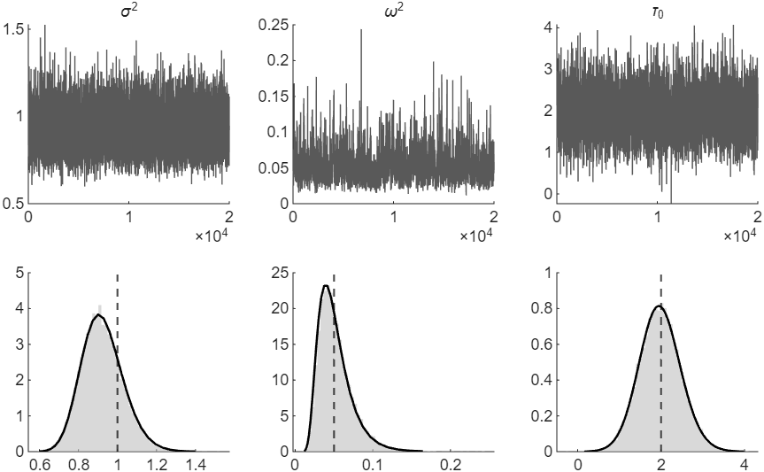

# How to Estimate a State Space Model by Gibbs Sampling

*Code: [`guide.m`](guide.m), with [`ssm.simulate_states`](../../core/+ssm/simulate_states.m),
[`ssm.diffmat`](../../core/+ssm/diffmat.m) and
[`ssm.inefficiency_factor`](../../core/+ssm/inefficiency_factor.m). Method:
[Chan and Jeliazkov (2009)](../../CITING.md#chan-and-jeliazkov-2009) and
[Chan (forthcoming)](../../CITING.md#chan-forthcoming), Sections 6.3, 6.5.2 and 9.1.1.*

A Gibbs sampler draws the unknowns of a model in blocks, each from its distribution given the data
and the current values of the other blocks, and repeats. In a state space model the states form
one block, which the precision sampler draws, and the parameters form the others. In this guide we
return to the local level model and the generated data of
[How to Draw the States of an Unobserved Components Model](../uc_states/). That guide holds the
two variances, $`\sigma^2`$ and $`\omega^2`$, and the initial value of the trend, $`\tau_0`$, at
their true values; here we estimate them along with the trend. Each iteration draws the trend as
in that guide and then the three parameters, each from a standard distribution.

To draw the figure first, run from the root of the repository:

```matlab
run guides/gibbs_sampler/guide.m
```

## The Model and Its Priors

The model is

$$y_t = \tau_t + \varepsilon_t, \qquad \varepsilon_t \sim \mathcal{N}(0, \sigma^2), \qquad\qquad \tau_t = \tau_{t-1} + \eta_t, \qquad \eta_t \sim \mathcal{N}(0, \omega^2),$$

with $`\sigma^2`$, $`\omega^2`$ and the initial value $`\tau_0`$ unknown. We use the priors of
Section 9.1.1 of the book *Bayesian Macroeconometrics* (Chan, forthcoming),

$$\tau_0 \sim \mathcal{N}(a_0, b_0), \qquad \sigma^2 \sim \mathcal{IG}(\nu_{\sigma^2}, S_{\sigma^2}), \qquad \omega^2 \sim \mathcal{IG}(\nu_{\omega^2}, S_{\omega^2}),$$

where $`\mathcal{IG}(\nu, S)`$ is the inverse-gamma distribution with shape $`\nu`$ and scale
$`S`$. The hyperparameters are those of the book's CPI application in Section 9.1.2: $`a_0 = 5`$,
$`b_0 = 100`$, $`\nu_{\sigma^2} = \nu_{\omega^2} = 3`$, $`S_{\sigma^2} = 2`$ and
$`S_{\omega^2} = 2 \times 0.25^2`$, so that the prior means of $`\sigma^2`$ and $`\omega^2`$ are 1
and $`0.25^2`$. The data are those of the first guide, generated with $`T = 200`$,
$`\sigma^2 = 1`$, $`\omega^2 = 0.05`$ and $`\tau_0 = 2`$.

## Step 1: Split the Unknowns into Blocks

The unknowns are the trend $`\boldsymbol{\tau} = (\tau_1, \ldots, \tau_T)'`$ and the parameters
$`\sigma^2`$, $`\omega^2`$ and $`\tau_0`$. Given the parameters, the trend is Gaussian with a
banded precision matrix; given the trend and the other parameters, each parameter has a standard
distribution. The sampler therefore cycles through four blocks:

1. $`(\boldsymbol{\tau} \mid \mathbf{y}, \sigma^2, \omega^2, \tau_0)`$, a Gaussian distribution,
   from the first guide;
2. $`(\sigma^2 \mid \mathbf{y}, \boldsymbol{\tau})`$, an inverse-gamma distribution;
3. $`(\omega^2 \mid \boldsymbol{\tau}, \tau_0)`$, an inverse-gamma distribution;
4. $`(\tau_0 \mid \tau_1, \omega^2)`$, a Gaussian distribution.

## Step 2: Derive the Conditional Distributions

**The trend.** Given the parameters, $`\mathbf{K}`$ and $`\mathbf{c}`$ are those of the first
guide, evaluated at the current values of $`\sigma^2`$, $`\omega^2`$ and $`\tau_0`$, and
[`ssm.simulate_states`](../../core/+ssm/simulate_states.m) takes one draw.

**The variances.** Given the trend, the errors
$`\boldsymbol{\varepsilon} = \mathbf{y} - \boldsymbol{\tau}`$ and
$`\boldsymbol{\eta} = \mathbf{H}\boldsymbol{\tau} - \tilde{\boldsymbol{\tau}}_0`$ are known, so
each variance is the variance of a normal sample with known mean zero, for which the inverse-gamma
prior is conjugate:

$$(\sigma^2 \mid \mathbf{y}, \boldsymbol{\tau}) \sim \mathcal{IG}\Big(\nu_{\sigma^2} + \frac{T}{2},\; S_{\sigma^2} + \frac{\boldsymbol{\varepsilon}'\boldsymbol{\varepsilon}}{2}\Big), \qquad (\omega^2 \mid \boldsymbol{\tau}, \tau_0) \sim \mathcal{IG}\Big(\nu_{\omega^2} + \frac{T}{2},\; S_{\omega^2} + \frac{\boldsymbol{\eta}'\boldsymbol{\eta}}{2}\Big).$$

To draw from $`\mathcal{IG}(\nu, S)`$, the code uses its relation to the gamma distribution: if
$`x \sim \mathcal{G}(\nu, S)`$, the gamma distribution with shape $`\nu`$ and rate $`S`$, then
$`1/x \sim \mathcal{IG}(\nu, S)`$ (Appendix A of the book). MATLAB's `gamrnd` parameterizes the
gamma distribution by its shape and its scale, the reciprocal of the rate, so the draw is
`1/gamrnd(nu, 1/S)`.

**The initial value.** $`\tau_0`$ enters only the first state equation,
$`\tau_1 = \tau_0 + \eta_1`$, and the recipe of the first guide applies with $`\tau_0`$ as the
unknown. Written as $`\tau_0 = \tau_1 - \eta_1`$, the equation has
$`(\mathbf{A}, \mathbf{d}, \mathbf{S}) = (1, \tau_1, \omega^2)`$; the prior, written as
$`\tau_0 = a_0 + e_0`$ with $`e_0 \sim \mathcal{N}(0, b_0)`$, has $`(1, a_0, b_0)`$. Adding the
two contributions gives

$$(\tau_0 \mid \tau_1, \omega^2) \sim \mathcal{N}\big(K_{\tau_0}^{-1}c_{\tau_0},\; K_{\tau_0}^{-1}\big), \qquad K_{\tau_0} = \frac{1}{b_0} + \frac{1}{\omega^2}, \qquad c_{\tau_0} = \frac{a_0}{b_0} + \frac{\tau_1}{\omega^2}.$$

These are the distributions of Section 9.1.1 of the book, with its AR(1) coefficient set to zero.

## Step 3: Write the Loop

```matlab
a0 = 5; b0 = 100;                                        % tau0 ~ N(a0, b0)
nu_sig = 3; S_sig = 2;                                   % sig2 ~ IG(nu_sig, S_sig)
nu_om = 3; S_om = 2*.25^2;                               % omega2 ~ IG(nu_om, S_om)
nsim = 20000; burnin = 1000;
H = ssm.diffmat(T); HH = H'*H;                           % computed once
sig2 = 1; omega2 = .1; tau0 = a0;                        % starting values
store_theta = zeros(nsim, 3); store_tau = zeros(T, nsim);
for isim = 1:burnin + nsim
    K = HH/omega2 + speye(T)/sig2;                       % the states: guides/uc_states
    c = H'*[tau0; zeros(T-1,1)]/omega2 + y/sig2;
    tau = ssm.simulate_states(K, c);
    sig2 = 1/gamrnd(nu_sig + T/2, 1/(S_sig + (y - tau)'*(y - tau)/2));
    eta = H*tau - [tau0; zeros(T-1,1)];                  % the state equation residuals
    omega2 = 1/gamrnd(nu_om + T/2, 1/(S_om + eta'*eta/2));
    Ktau0 = 1/b0 + 1/omega2;                             % tau0 given tau_1 and omega2
    tau0 = (a0/b0 + tau(1)/omega2)/Ktau0 + randn/sqrt(Ktau0);
    if isim > burnin
        store_theta(isim - burnin, :) = [sig2 omega2 tau0];
        store_tau(:, isim - burnin) = tau;
    end
end
```

The matrix $`\mathbf{H}'\mathbf{H}`$ does not depend on the parameters, so it is computed once;
$`\mathbf{K}`$ and $`\mathbf{c}`$ are rebuilt at every iteration from the current parameters. The
chain starts from $`\sigma^2 = 1`$, $`\omega^2 = 0.1`$ and $`\tau_0 = 5`$, and the first 1,000
iterations are discarded as burn-in, which lets the chain move away from its starting values
before any draws are kept.

## Step 4: Check the Chain

In Figure 1, the draws of each parameter fluctuate around a stable level throughout, with no
drift. Successive draws are correlated, and the inefficiency factor (see Section 6.5.2 of the
book) measures by how much: it is approximately the number of draws that carry the information of
one independent draw. Computed by
[`ssm.inefficiency_factor`](../../core/+ssm/inefficiency_factor.m) with Bartlett weights up to lag
200, the inefficiency factors are 4.0 for $`\sigma^2`$, 27.5 for $`\omega^2`$ and 9.3 for
$`\tau_0`$, so the 20,000 draws of $`\omega^2`$ carry about as much information as 730 independent
draws. The draws of $`\omega^2`$ are the most correlated because the sampler draws $`\omega^2`$
given the trend and the trend given $`\omega^2`$, and the two are strongly dependent in the
posterior.

| | True value | Posterior mean | 90% interval | Inefficiency factor |
|---|---|---|---|---|
| $`\sigma^2`$ | 1 | 0.92 | (0.76, 1.11) | 4.0 |
| $`\omega^2`$ | 0.05 | 0.053 | (0.026, 0.094) | 27.5 |
| $`\tau_0`$ | 2 | 1.98 | (1.18, 2.82) | 9.3 |



*Figure 1: Top, the 20,000 draws of $`\sigma^2`$, $`\omega^2`$ and $`\tau_0`$ kept after the
burn-in, in the order the sampler makes them. Bottom, their histograms, the posterior densities
computed on a grid without the sampler (solid lines; see How We Check It) and the true values
(dashed lines).*

The trend estimated with the parameters unknown is close to the trend of the first guide, where
they are known: the posterior means differ by at most 0.08 posterior standard deviations, the 90
percent intervals average 1.10 in width in both, and they contain the true trend in 181 and 180 of
the 200 periods.

## How We Check It

<details>
<summary>The posterior of the parameters on a grid, computed without the sampler</summary>

With $`\tau_0`$ moved into the states,
$`\boldsymbol{\alpha} = (\tau_0, \tau_1, \ldots, \tau_T)'`$, the model is linear Gaussian given
$`\sigma^2`$ and $`\omega^2`$: the prior of $`\tau_0`$ becomes the first state equation,
$`\tau_0 = a_0 + e_0`$, and the prior of $`\boldsymbol{\alpha}`$ has a banded precision matrix.
[`ssm.intlike`](../../core/+ssm/intlike.m) then returns the likelihood
$`p(\mathbf{y} \mid \sigma^2, \omega^2)`$ with $`\boldsymbol{\alpha}`$ integrated out, which
[How to Compute the Integrated Likelihood of a State Space Model](../integrated_likelihood/)
explains. `guide.m` multiplies it by the priors on a 60 × 60 grid of $`\log\sigma^2`$ and
$`\log\omega^2`$, which spans 8 standard deviations of the logged draws on either side of their
mean, and normalizes; the largest weight on the edge of the grid is 7e-12 of the largest weight.

The Monte Carlo standard error of a posterior mean is the standard deviation of the draws times
the square root of the inefficiency factor over the number of draws (Section 6.5.2 of the book),
which [`ssm.mcse`](../../core/+ssm/mcse.m) computes. The posterior means of the Gibbs draws differ
from the grid values by at most 1.9 Monte Carlo standard errors, and their standard deviations by
at most 0.9 percent. For the trend, the grid gives $`E(\boldsymbol{\tau} \mid \mathbf{y})`$ as the
weighted average of the conditional means that `ssm.intlike` returns; the largest of the 200
differences from the Gibbs means is 2.9 Monte Carlo standard errors, about the size expected of
the largest of 200 standard normal draws.

</details>

## Adapt It Yourself

Let the transitory component follow the AR(1) process of Step 4 of the first guide,
$`\varepsilon_t = \rho\varepsilon_{t-1} + u_t`$ with $`u_t \sim \mathcal{N}(0, \sigma^2)`$, and
give $`\rho`$ the prior $`\rho \sim \mathcal{U}(-1, 1)`$. Which blocks change, and what is the new
one?

<details>
<summary>Answer</summary>

Two blocks change and one is added, as in the sampler of Section 9.1.1 of the book. The trend uses
$`\mathbf{K}`$ and $`\mathbf{c}`$ of Step 4 of the first guide, at the current $`\rho`$. The draw
of $`\sigma^2`$ uses the AR(1) residuals $`\mathbf{u} = \mathbf{H}_\rho\boldsymbol{\varepsilon}`$
in place of $`\boldsymbol{\varepsilon}`$. The new block draws $`\rho`$: given the trend,
$`\boldsymbol{\varepsilon} = \mathbf{y} - \boldsymbol{\tau}`$ is known, and
$`\varepsilon_t = \rho\varepsilon_{t-1} + u_t`$ for $`t = 2, \ldots, T`$ is a regression of
$`\varepsilon_t`$ on $`\varepsilon_{t-1}`$, so that

$$(\rho \mid \mathbf{y}, \boldsymbol{\tau}, \sigma^2) \sim \mathcal{TN}_{(-1,1)}\big(\hat{\rho}, K_\rho^{-1}\big), \qquad K_\rho = \frac{1}{\sigma^2}\sum_{t=1}^{T-1}\varepsilon_t^2, \qquad \hat{\rho} = \frac{\sum_{t=1}^{T-1}\varepsilon_{t+1}\varepsilon_t}{\sum_{t=1}^{T-1}\varepsilon_t^2},$$

the normal distribution truncated to $`(-1, 1)`$, which
[`ssm.tnormrnd`](../../core/+ssm/tnormrnd.m) draws. In the loop, the first four lines replace the
draw of the trend, and the rest draw $`\rho`$ and replace the draw of $`\sigma^2`$:

```matlab
Hrho = ssm.diffmat(T, rho); HHrho = Hrho'*Hrho;
K = HH/omega2 + HHrho/sig2;                              % Step 4 of guides/uc_states
c = H'*[tau0; zeros(T-1,1)]/omega2 + HHrho*y/sig2;
tau = ssm.simulate_states(K, c);
e = y - tau;                                             % the transitory component
Krho = e(1:T-1)'*e(1:T-1)/sig2;
rhohat = (e(1:T-1)'*e(2:T))/(e(1:T-1)'*e(1:T-1));
rho = ssm.tnormrnd(rhohat, 1/Krho, -1, 1);
u = ssm.diffmat(T, rho)*e;                               % the AR(1) residuals
sig2 = 1/gamrnd(nu_sig + T/2, 1/(S_sig + u'*u/2));
```

`guide.m` runs this sampler, starting from $`\rho = 0`$, on data generated with $`\rho = 0.5`$ and
the other parameters as before, and checks it against the posterior on a grid of
$`(\rho, \sigma^2, \omega^2)`$; the posterior means agree to within 0.9 Monte Carlo standard
errors. The draws of $`\omega^2`$ mix more slowly still, with an inefficiency factor of 45.

</details>

## Next

[How to Compute the Integrated Likelihood of a State Space Model](../integrated_likelihood/)
computes $`p(\mathbf{y} \mid \sigma^2, \omega^2)`$ with the states integrated out, the quantity
behind the check above, and uses it to draw the variances without the states; the draws of
$`\omega^2`$ then become nearly independent. Among the examples,
[ex01](../../examples/ex01_precision_sampler.m) runs this sampler on US CPI inflation, and
[ex02](../../examples/ex02_integrated_likelihood.m) runs the sampler with an AR(1) transitory
component on US PCE inflation.

## Using This Method in Your Research

The sampler is the one of Section 9.1.1 of the book, which draws the states by the precision
sampler of Chan and Jeliazkov (2009). [`CITING.md`](../../CITING.md) lists the paper behind each
function of the toolkit and how to cite the toolkit itself.

## References

Chan, J. C. C. (forthcoming). *Bayesian Macroeconometrics: Methods and Applications*. Chapman &
Hall/CRC. [Code repository](https://github.com/joshuaccchan/bayesian-macroeconometrics)

Chan, J. C. C. and Jeliazkov, I. (2009). Efficient Simulation and Integrated Likelihood Estimation
in State Space Models. *International Journal of Mathematical Modelling and Numerical
Optimisation*, 1(1/2): 101-120.
[doi:10.1504/IJMMNO.2009.030090](https://doi.org/10.1504/IJMMNO.2009.030090)
