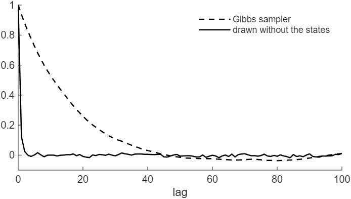

# How to Compute the Integrated Likelihood of a State Space Model

*Code: [`guide.m`](guide.m), with [`ssm.intlike`](../../core/+ssm/intlike.m),
[`ssm.simulate_states`](../../core/+ssm/simulate_states.m),
[`ssm.diffmat`](../../core/+ssm/diffmat.m) and
[`ssm.inefficiency_factor`](../../core/+ssm/inefficiency_factor.m). Method:
[Chan and Jeliazkov (2009)](../../CITING.md#chan-and-jeliazkov-2009) and
[Chan (forthcoming)](../../CITING.md#chan-forthcoming), Sections 6.2.2, 6.3.2 and 9.2.*

The integrated likelihood of a state space model, also called the observed-data likelihood, is the
density of the data given the parameters, with the states integrated out:

$$p(\mathbf{y} \mid \boldsymbol{\theta}) = \int p(\mathbf{y} \mid \boldsymbol{\alpha}, \boldsymbol{\theta})\, p(\boldsymbol{\alpha} \mid \boldsymbol{\theta})\, d\boldsymbol{\alpha}.$$

Model comparison by marginal likelihood needs it, and so does any sampler that draws the
parameters without the states. For a linear Gaussian model the integral has a closed form, and
[`ssm.intlike`](../../core/+ssm/intlike.m) evaluates it with the same banded precision matrix that
the precision sampler uses, at a cost proportional to $`T`$. In this guide we compute it for the
local level model of [How to Draw the States of an Unobserved Components Model](../uc_states/),
first with the initial value of the trend known and then with it integrated out as well. We then
use it to draw the two variances of
[How to Estimate a State Space Model by Gibbs Sampling](../gibbs_sampler/) without the states: the
draws of $`\omega^2`$, whose inefficiency factor is 27 in that guide's Gibbs sampler, become
nearly independent.

To draw the figure first, run from the root of the repository:

```matlab
run guides/integrated_likelihood/guide.m
```

## The Model as a Regression on the States

Section 9.2 of the book *Bayesian Macroeconometrics* (Chan, forthcoming) writes a linear Gaussian
state space model in stacked form, as a regression on the states with a Gaussian prior:

$$\mathbf{y} = \mathbf{Z}\boldsymbol{\alpha} + \boldsymbol{\varepsilon}, \qquad \boldsymbol{\varepsilon} \sim \mathcal{N}(\mathbf{0}, \mathbf{R}), \qquad\qquad \boldsymbol{\alpha} \sim \mathcal{N}(\mathbf{b}, \mathbf{P}^{-1}).$$

The prior comes from the state equation
$`\mathbf{G}\boldsymbol{\alpha} = \tilde{\mathbf{b}} + \boldsymbol{\eta}`$ with
$`\boldsymbol{\eta} \sim \mathcal{N}(\mathbf{0}, \mathbf{Q})`$, so that
$`\mathbf{P} = \mathbf{G}'\mathbf{Q}^{-1}\mathbf{G}`$ and
$`\mathbf{b} = \mathbf{G}^{-1}\tilde{\mathbf{b}}`$. For the local level model with $`\tau_0`$
known, $`\boldsymbol{\alpha} = \boldsymbol{\tau}`$, $`\mathbf{Z} = \mathbf{I}_T`$,
$`\mathbf{R} = \sigma^2 \mathbf{I}_T`$, $`\mathbf{G} = \mathbf{H}`$ and
$`\mathbf{Q} = \omega^2 \mathbf{I}_T`$, so that $`\mathbf{P} = \mathbf{H}'\mathbf{H}/\omega^2`$
and $`\mathbf{b} = \tau_0\mathbf{1}`$, the prior of the trend derived in Section 9.1.1 of the
book.

## Step 1: Evaluate the Density at the Posterior Mean

For any value of $`\boldsymbol{\alpha}`$, Bayes' theorem gives

$$p(\mathbf{y} \mid \boldsymbol{\theta}) = \frac{p(\mathbf{y} \mid \boldsymbol{\alpha}, \boldsymbol{\theta})\, p(\boldsymbol{\alpha} \mid \boldsymbol{\theta})}{p(\boldsymbol{\alpha} \mid \mathbf{y}, \boldsymbol{\theta})}.$$

The three densities on the right are Gaussian. The one in the denominator is
$`\mathcal{N}(\hat{\boldsymbol{\alpha}}, \mathbf{K}^{-1})`$, with
$`\mathbf{K} = \mathbf{P} + \mathbf{Z}'\mathbf{R}^{-1}\mathbf{Z}`$ and
$`\mathbf{K}\hat{\boldsymbol{\alpha}} = \mathbf{P}\mathbf{b} + \mathbf{Z}'\mathbf{R}^{-1}\mathbf{y}`$
(Theorem 9.1 of the book): the $`\mathbf{K}`$ and $`\mathbf{c}`$ of the first guide. At
$`\boldsymbol{\alpha} = \hat{\boldsymbol{\alpha}}`$ its exponent is zero, and taking logs gives

$$\log p(\mathbf{y} \mid \boldsymbol{\theta}) = -\frac{T}{2}\log(2\pi) + \frac{1}{2}\log|\mathbf{R}^{-1}| + \frac{1}{2}\log|\mathbf{P}| - \frac{1}{2}\log|\mathbf{K}| - \frac{1}{2}(\mathbf{y} - \mathbf{Z}\hat{\boldsymbol{\alpha}})'\mathbf{R}^{-1}(\mathbf{y} - \mathbf{Z}\hat{\boldsymbol{\alpha}}) - \frac{1}{2}(\hat{\boldsymbol{\alpha}} - \mathbf{b})'\mathbf{P}(\hat{\boldsymbol{\alpha}} - \mathbf{b}).$$

This is the approach of Chan and Jeliazkov (2009, Section 2.3), who evaluate the identity of Chib
(1995) at the posterior mean. Every term needs banded matrices only: $`\hat{\boldsymbol{\alpha}}`$
comes from the Cholesky factor $`\mathbf{C}`$ of $`\mathbf{K}`$, as in the first guide, and each
log determinant from the diagonal of a Cholesky factor,
$`\log|\mathbf{K}| = 2\sum_i \log C_{ii}`$. The $`T \times T`$ covariance matrix of
$`\mathbf{y}`$, $`\mathbf{R} + \mathbf{Z}\mathbf{P}^{-1}\mathbf{Z}'`$, is never formed.

## Step 2: Call ssm.intlike

```matlab
H = ssm.diffmat(T); HH = H'*H;
ll = ssm.intlike(y, speye(T), speye(T)/sig2, HH/omega2, tau0*ones(T,1));
```

The arguments are $`\mathbf{y}`$, $`\mathbf{Z}`$, $`\mathbf{R}^{-1}`$, $`\mathbf{P}`$ and
$`\mathbf{b}`$. The third is the precision matrix of the transitory component, and the three
matrices are sparse. On the data of the first guide, at the true values $`\sigma^2 = 1`$,
$`\omega^2 = 0.05`$ and $`\tau_0 = 2`$, it returns $`-298.0393`$. Two further outputs are
$`\hat{\boldsymbol{\alpha}}`$ and $`\mathbf{K}`$.

## Step 3: Integrate Out the Initial Value Too

The initial value $`\tau_0`$ can be integrated out with the trend. Move it into the states,
$`\boldsymbol{\alpha} = (\tau_0, \tau_1, \ldots, \tau_T)'`$, and write its prior
$`\tau_0 \sim \mathcal{N}(a_0, b_0)`$ as one more state equation, $`\tau_0 = a_0 + \eta_0`$ with
$`\eta_0 \sim \mathcal{N}(0, b_0)`$. The state equations then stack into
$`\mathbf{G}\boldsymbol{\alpha} = \tilde{\mathbf{b}} + \boldsymbol{\eta}`$, with $`\mathbf{G}`$
the $`(T+1) \times (T+1)`$ first-difference matrix, $`\tilde{\mathbf{b}} = (a_0, 0, \ldots, 0)'`$
and $`\mathbf{Q} = \mathrm{diag}(b_0, \omega^2, \ldots, \omega^2)`$, so that
$`\mathbf{b} = a_0\mathbf{1}`$. The measurement equation has
$`\mathbf{Z} = (\mathbf{0}, \mathbf{I}_T)`$, which skips $`\tau_0`$:

```matlab
a0 = 5; b0 = 100;                                        % tau0 ~ N(a0, b0)
G = ssm.diffmat(T+1);                                    % alpha = (tau0, tau')'
Z = [sparse(T,1) speye(T)];
b = a0*ones(T+1,1);                                      % the prior mean of alpha
P = G'*spdiags([1/b0; ones(T,1)/omega2], 0, T+1, T+1)*G;  % its prior precision
ll0 = ssm.intlike(y, Z, speye(T)/sig2, P, b);
```

The result, $`p(\mathbf{y} \mid \sigma^2, \omega^2)`$, depends on the two variances only.

## Step 4: Draw the Variances Without the States

With the states integrated out, the posterior of the variances is known up to a constant,
$`p(\sigma^2, \omega^2 \mid \mathbf{y}) \propto p(\mathbf{y} \mid \sigma^2, \omega^2)\,p(\sigma^2)\,p(\omega^2)`$.
A sampler can draw them from it directly and then draw the states given them: a collapsed sampler
(Section 6.3.2 of the book), whose draws of the variances do not depend on the previous draw of
the states. We draw $`\boldsymbol{\varphi} = (\log\sigma^2, \log\omega^2)'`$ by independence-chain
Metropolis-Hastings (Section 6.2.2 of the book). The proposal $`q`$ is a t distribution with 5
degrees of freedom, located at the mode of the log posterior of $`\boldsymbol{\varphi}`$ and
scaled by the inverse of its negative Hessian there: the normal approximation of Section 6.2.2,
with heavier tails. A candidate $`\boldsymbol{\varphi}^*`$ replaces the current
$`\boldsymbol{\varphi}`$ with probability

$$\min\left\{1,\ \frac{p(\boldsymbol{\varphi}^* \mid \mathbf{y})\, q(\boldsymbol{\varphi})}{p(\boldsymbol{\varphi} \mid \mathbf{y})\, q(\boldsymbol{\varphi}^*)}\right\}.$$

Given the variances, $`\boldsymbol{\alpha} = (\tau_0, \boldsymbol{\tau}')'`$ is Gaussian with
$`\mathbf{K} = \mathbf{P} + \mathbf{Z}'\mathbf{Z}/\sigma^2`$ and
$`\mathbf{c} = \mathbf{P}\mathbf{b} + \mathbf{Z}'\mathbf{y}/\sigma^2`$ (Theorem 9.1 of the book).
In code, with the priors of the second guide:

```matlab
nu_sig = 3; S_sig = 2; nu_om = 3; S_om = 2*.25^2;        % as in guides/gibbs_sampler
logig = @(x, nu, S) nu*log(S) - gammaln(nu) - (nu + 1)*log(x) - S./x;
A0 = sparse(1, 1, 1/b0, T+1, T+1);                       % P = A0 + A1/omega2
A1 = G'*spdiags([0; ones(T,1)], 0, T+1, T+1)*G;
lpost = @(phi) ssm.intlike(y, Z, speye(T)*exp(-phi(1)), A0 + A1*exp(-phi(2)), b) ...
    + logig(exp(phi(1)), nu_sig, S_sig) + logig(exp(phi(2)), nu_om, S_om) + sum(phi);
% the proposal: a t distribution with 5 degrees of freedom, located at the mode of lpost
% and scaled by the inverse of its negative Hessian there, from finite differences
phihat = fminsearch(@(phi) -lpost(phi), [0; log(.1)]);
h = 1e-3; E = h*eye(2); Hs = zeros(2);
for i = 1:2
    for j = 1:2
        Hs(i,j) = (lpost(phihat + E(:,i) + E(:,j)) - lpost(phihat + E(:,i) - E(:,j)) ...
            - lpost(phihat - E(:,i) + E(:,j)) + lpost(phihat - E(:,i) - E(:,j)))/(4*h^2);
    end
end
C = chol(inv(-Hs), 'lower'); nu = 5;
logq = @(phi) -(nu + 2)/2*log(1 + sum((C\(phi - phihat)).^2)/nu);
nsim = 20000; burnin = 1000;
phi = phihat; lw = lpost(phi) - logq(phi);
store_theta = zeros(nsim, 3);
for isim = 1:burnin + nsim
    phic = phihat + C*randn(2,1)/sqrt(gamrnd(nu/2, 2/nu));  % a draw from the proposal
    lwc = lpost(phic) - logq(phic);
    if log(rand) < lwc - lw                              % independence-chain MH
        phi = phic; lw = lwc;
    end
    sig2 = exp(phi(1)); omega2 = exp(phi(2));
    P = A0 + A1/omega2;
    alpha = ssm.simulate_states(P + Z'*Z/sig2, P*b + Z'*y/sig2);  % Theorem 9.1
    if isim > burnin
        store_theta(isim - burnin, :) = [sig2 omega2 alpha(1)];
    end
end
```

The log posterior of $`\boldsymbol{\varphi}`$ includes $`\log\sigma^2 + \log\omega^2`$, the
Jacobian of the change of variables.
[`fminsearch`](https://www.mathworks.com/help/matlab/ref/fminsearch.html) finds the mode, and the
Hessian comes from finite differences. Each iteration evaluates the integrated likelihood once, at
the candidate; the value at the current $`\boldsymbol{\varphi}`$ is kept from the iteration that
accepted it.

The chain accepts 86 percent of the proposals, and the draws of all three parameters are nearly
independent (Figure 1). The inefficiency factors, from `ssm.inefficiency_factor` with Bartlett
weights up to lag 200, are:

| Inefficiency factor | $`\sigma^2`$ | $`\omega^2`$ | $`\tau_0`$ |
|---|---|---|---|
| Gibbs sampler of the second guide | 4.3 | 26.9 | 11.2 |
| Drawn without the states | 1.1 | 1.1 | 0.8 |

Each iteration takes about four times as long as an iteration of the Gibbs sampler, since it
evaluates the integrated likelihood and draws all $`T + 1`$ states. Per second, the sampler
therefore delivers 4–8 times as many effective draws of $`\omega^2`$, the parameter that mixes
slowest in the Gibbs sampler, and about as many of $`\sigma^2`$.



*Figure 1: The autocorrelations of the 20,000 draws of $`\omega^2`$, from the Gibbs sampler of the
second guide (dashed) and from the sampler that draws the variances without the states (solid), on
the same data.*

## How We Check It

<details>
<summary>The dense normal density of y, and the posterior on a grid</summary>

With $`\tau_0`$ known,
$`\mathbf{y} \sim \mathcal{N}(\tau_0\mathbf{1}, \sigma^2 \mathbf{I}_T + \omega^2(\mathbf{H}'\mathbf{H})^{-1})`$,
and with $`\tau_0`$ integrated out,
$`\mathbf{y} \sim \mathcal{N}(a_0\mathbf{1}, \sigma^2 \mathbf{I}_T + \omega^2(\mathbf{H}'\mathbf{H})^{-1} + b_0\mathbf{1}\mathbf{1}')`$.
`guide.m` evaluates these normal densities with dense $`T \times T`$ matrices. With $`\tau_0`$
known, `ssm.intlike` agrees with them to within 5e-15 relative to the value, at four parameter
values; with $`\tau_0`$ integrated out, to within 8e-15.

The posterior means of $`\sigma^2`$, $`\omega^2`$ and $`\tau_0`$ are 0.923, 0.051 and 1.975 from
this sampler and 0.923, 0.051 and 1.976 from the Gibbs sampler. On a 60 × 60 grid of
$`\log\sigma^2`$ and $`\log\omega^2`$, the posterior from `lpost` gives 0.923, 0.051 and 1.974,
and the means of this sampler differ from the grid values by at most 1.8 Monte Carlo standard
errors.

The timings depend on the machine and its load, and `guide.m` prints them. Over four runs on the
machine that produced this page, an iteration of this sampler took 3.3 to 5.7 times as long as an
iteration of the Gibbs sampler, and the effective draws of $`\omega^2`$ per second were 4.5 to 7.7
times as many.

</details>

## Adapt It Yourself

With the AR(1) transitory component of Step 4 of the first guide, which argument of `ssm.intlike`
changes?

<details>
<summary>Answer</summary>

Only $`\mathbf{R}^{-1}`$. The transitory component has covariance matrix
$`\sigma^2(\mathbf{H}_\rho'\mathbf{H}_\rho)^{-1}`$, so
$`\mathbf{R}^{-1} = \mathbf{H}_\rho'\mathbf{H}_\rho/\sigma^2`$, which is banded:

```matlab
Hrho = ssm.diffmat(T, rho);
ll = ssm.intlike(y, speye(T), Hrho'*Hrho/sig2, HH/omega2, tau0*ones(T,1));
```

`guide.m` checks this against the dense normal density with $`\rho = 0.8`$; they agree to within
2e-15 relative to the value.

</details>

## Next

Among the examples, [ex02](../../examples/ex02_integrated_likelihood.m) uses `ssm.intlike` to
compare the local level model with a serially uncorrelated and with an AR(1) transitory component
on US PCE inflation. It estimates the marginal likelihood of each model by importance sampling
over the parameters.

## Using This Method in Your Research

The method is that of Chan and Jeliazkov (2009, Section 2.3), who evaluate the identity of Chib
(1995) at the posterior mean of the states. [`CITING.md`](../../CITING.md) lists the paper behind
each function of the toolkit and how to cite the toolkit itself.

## References

Chan, J. C. C. (forthcoming). *Bayesian Macroeconometrics: Methods and Applications*. Chapman &
Hall/CRC. [Code repository](https://github.com/joshuaccchan/bayesian-macroeconometrics)

Chan, J. C. C. and Jeliazkov, I. (2009). Efficient Simulation and Integrated Likelihood Estimation
in State Space Models. *International Journal of Mathematical Modelling and Numerical
Optimisation*, 1(1/2): 101-120.
[doi:10.1504/IJMMNO.2009.030090](https://doi.org/10.1504/IJMMNO.2009.030090)

Chib, S. (1995). Marginal Likelihood from the Gibbs Output. *Journal of the American Statistical
Association*, 90(432): 1313-1321.
[doi:10.1080/01621459.1995.10476635](https://doi.org/10.1080/01621459.1995.10476635)
