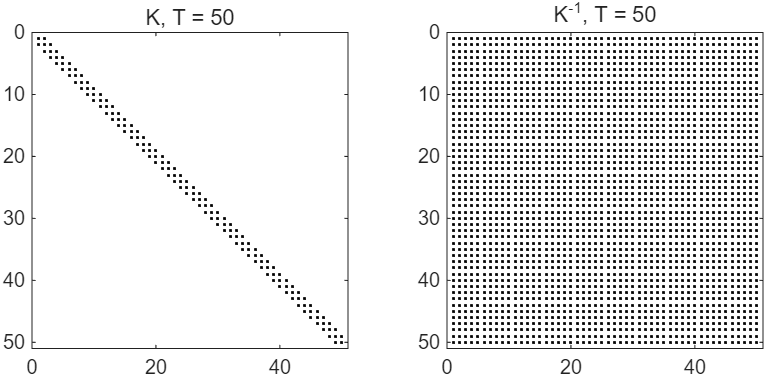
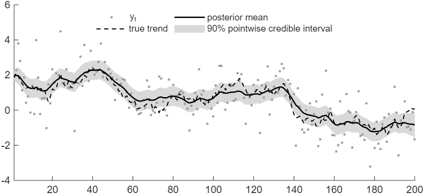
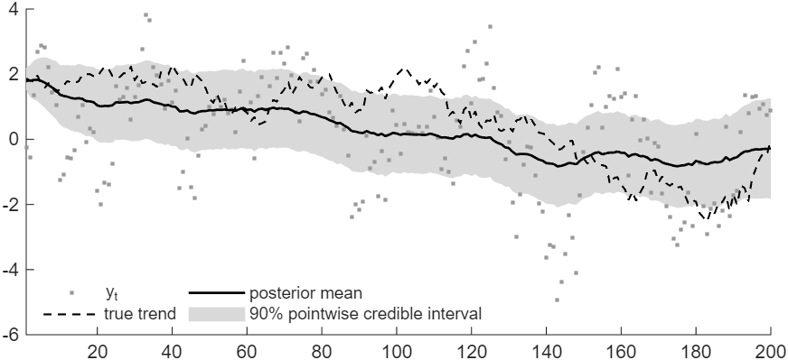

# How to Draw the States of an Unobserved Components Model

*Code: [`guide.m`](guide.m), with [`ssm.simulate_states`](../../core/+ssm/simulate_states.m) and
[`ssm.diffmat`](../../core/+ssm/diffmat.m). Method:
[Chan and Jeliazkov (2009)](../../CITING.md#chan-and-jeliazkov-2009) and
[Chan (forthcoming)](../../CITING.md#chan-forthcoming), Sections 9.1.1 and 9.2.*

The precision sampler draws the whole path of the states at once from their conditional
distribution, $`\mathcal{N}(\hat{\boldsymbol{\tau}}, \mathbf{K}^{-1})`$. It needs two inputs: the
precision matrix $`\mathbf{K}`$ and the vector $`\mathbf{c}`$ with
$`\mathbf{K}\hat{\boldsymbol{\tau}} = \mathbf{c}`$. In this guide we draw the trend of a local
level model: we stack the model's equations over time, read $`\mathbf{K}`$ and $`\mathbf{c}`$ off
the log density, and call [`ssm.simulate_states`](../../core/+ssm/simulate_states.m). Then we
change one equation and update $`\mathbf{K}`$ and $`\mathbf{c}`$ to match. Throughout, the
parameters and the initial value of the trend are known, and we draw the trend given them and the
data; [How to Estimate a State Space Model by Gibbs Sampling](../gibbs_sampler/) draws the
parameters as well.

To draw the figures first, run from the root of the repository:

```matlab
run guides/uc_states/guide.m
```

## The Local Level Model

The model decomposes $`y_t`$ into a trend and a transitory component,

$$y_t = \tau_t + \varepsilon_t, \qquad \varepsilon_t \sim \mathcal{N}(0, \sigma^2), \qquad\qquad \tau_t = \tau_{t-1} + \eta_t, \qquad \eta_t \sim \mathcal{N}(0, \omega^2),$$

where the trend starts from a known $`\tau_0`$. Section 9.1.1 of the book *Bayesian
Macroeconometrics* (Chan, forthcoming) lets the transitory component follow an AR(1) process; we
start with a serially uncorrelated transitory component and add the AR(1) in Step 4.

## Step 1: Stack the Equations

Stacked over $`t = 1, \ldots, T`$, the measurement equation is
$`\mathbf{y} = \boldsymbol{\tau} + \boldsymbol{\varepsilon}`$ with
$`\boldsymbol{\varepsilon} \sim \mathcal{N}(\mathbf{0}, \sigma^2 \mathbf{I}_T)`$. The state
equation, written as $`\tau_1 - \tau_0 = \eta_1`$ and $`\tau_t - \tau_{t-1} = \eta_t`$ for
$`t > 1`$, stacks into
$`\mathbf{H}\boldsymbol{\tau} = \tilde{\boldsymbol{\tau}}_0 + \boldsymbol{\eta}`$ with
$`\boldsymbol{\eta} \sim \mathcal{N}(\mathbf{0}, \omega^2 \mathbf{I}_T)`$,
$`\tilde{\boldsymbol{\tau}}_0 = (\tau_0, 0, \ldots, 0)'`$ and the first-difference matrix

$$\mathbf{H} = \begin{bmatrix} 1 & 0 & 0 & \cdots & 0 \\ -1 & 1 & 0 & \cdots & 0 \\ 0 & -1 & 1 & \cdots & 0 \\ \vdots & & \ddots & \ddots & \vdots \\ 0 & \cdots & 0 & -1 & 1 \end{bmatrix},$$

which [`ssm.diffmat`](../../core/+ssm/diffmat.m) returns as a sparse matrix.

## Step 2: Read $`\mathbf{K}`$ and $`\mathbf{c}`$ off the Log Density

The two stacked equations give the log density of $`\boldsymbol{\tau}`$ given $`\mathbf{y}`$, up
to a constant:

$$\log p(\boldsymbol{\tau} \mid \mathbf{y}) = -\frac{1}{2\sigma^2}(\mathbf{y} - \boldsymbol{\tau})'(\mathbf{y} - \boldsymbol{\tau}) - \frac{1}{2\omega^2}(\mathbf{H}\boldsymbol{\tau} - \tilde{\boldsymbol{\tau}}_0)'(\mathbf{H}\boldsymbol{\tau} - \tilde{\boldsymbol{\tau}}_0) + \text{const} = -\frac{1}{2}\left(\boldsymbol{\tau}'\mathbf{K}\boldsymbol{\tau} - 2\boldsymbol{\tau}'\mathbf{c}\right) + \text{const}.$$

Collecting the terms quadratic in $`\boldsymbol{\tau}`$ gives $`\mathbf{K}`$, and the terms linear
in $`\boldsymbol{\tau}`$ give $`\mathbf{c}`$:

$$\mathbf{K} = \frac{1}{\omega^2}\mathbf{H}'\mathbf{H} + \frac{1}{\sigma^2}\mathbf{I}_T, \qquad \mathbf{c} = \frac{1}{\omega^2}\mathbf{H}'\tilde{\boldsymbol{\tau}}_0 + \frac{1}{\sigma^2}\mathbf{y}.$$

Since

$$\boldsymbol{\tau}'\mathbf{K}\boldsymbol{\tau} - 2\boldsymbol{\tau}'\mathbf{c} = (\boldsymbol{\tau} - \mathbf{K}^{-1}\mathbf{c})'\mathbf{K}(\boldsymbol{\tau} - \mathbf{K}^{-1}\mathbf{c}) - \mathbf{c}'\mathbf{K}^{-1}\mathbf{c},$$

the conditional distribution is $`\mathcal{N}(\hat{\boldsymbol{\tau}}, \mathbf{K}^{-1})`$ with
$`\mathbf{K}\hat{\boldsymbol{\tau}} = \mathbf{c}`$. Section 9.1.1 of the book derives the same
result from the regression result of its Theorem 3.1, and Theorem 9.1 states it for any linear
Gaussian state space model.

The calculation is the step to remember, because it carries over to any model. An equation
$`\mathbf{A}\boldsymbol{\tau} = \mathbf{d} + \mathbf{e}`$ with
$`\mathbf{e} \sim \mathcal{N}(\mathbf{0}, \mathbf{S})`$, independent of the other equations,
contributes
$`-\frac{1}{2}(\mathbf{A}\boldsymbol{\tau} - \mathbf{d})'\mathbf{S}^{-1}(\mathbf{A}\boldsymbol{\tau} - \mathbf{d})`$
to the log density, and so adds $`\mathbf{A}'\mathbf{S}^{-1}\mathbf{A}`$ to $`\mathbf{K}`$ and
$`\mathbf{A}'\mathbf{S}^{-1}\mathbf{d}`$ to $`\mathbf{c}`$. Here the measurement equation has
$`(\mathbf{A}, \mathbf{d}, \mathbf{S}) = (\mathbf{I}_T, \mathbf{y}, \sigma^2 \mathbf{I}_T)`$ and
the state equation $`(\mathbf{H}, \tilde{\boldsymbol{\tau}}_0, \omega^2 \mathbf{I}_T)`$. For a
model of your own, write each block of equations in this form, add up their contributions, and,
provided $`\mathbf{K}`$ is positive definite, pass $`\mathbf{K}`$ and $`\mathbf{c}`$ to the
sampler. In code:

```matlab
H = ssm.diffmat(T);                                      % first differences
K = H'*H/omega2 + speye(T)/sig2;                         % quadratic terms
c = H'*[tau0; zeros(T-1,1)]/omega2 + y/sig2;             % linear terms: K*tauhat = c
```

$`\mathbf{K}`$ is tridiagonal. With $`\sigma^2 = 1`$ and $`\omega^2 = 0.05`$ its top left corner
is

$$\begin{bmatrix} 41 & -20 & 0 & 0 \\ -20 & 41 & -20 & 0 \\ 0 & -20 & 41 & -20 \\ 0 & 0 & -20 & 41 \end{bmatrix},$$

while $`\mathbf{K}^{-1}`$, the covariance matrix, has no zero entries (Figure 1; Figure 9.1 of the
book makes the same point for $`T = 500`$).



*Figure 1: The nonzero entries of $`\mathbf{K}`$ and of $`\mathbf{K}^{-1}`$ for the local level
model with $`T = 50`$.*

## Step 3: Draw the States

```matlab
[draws, tauhat] = ssm.simulate_states(K, c, 5000);       % 5,000 independent draws
```

`ssm.simulate_states` follows Algorithm 9.1 of the book: it computes the Cholesky factor
$`\mathbf{K} = \mathbf{C}\mathbf{C}'`$ and returns the draws
$`\hat{\boldsymbol{\tau}} + \mathbf{w}`$, where $`\mathbf{C}'\mathbf{w} = \mathbf{z}`$ with
$`\mathbf{z} \sim \mathcal{N}(\mathbf{0}, \mathbf{I}_T)`$, so that
$`\mathrm{Cov}(\mathbf{w}) = (\mathbf{C}')^{-1}\mathbf{C}^{-1} = \mathbf{K}^{-1}`$. Algorithm 9.1
takes the mean $`\hat{\boldsymbol{\tau}}`$ as given; the function takes $`\mathbf{c}`$ instead and
computes $`\hat{\boldsymbol{\tau}}`$ from the same factor, as in Algorithm 1 of Chan and Jeliazkov
(2009). Since $`\mathbf{K}`$ is banded, so is $`\mathbf{C}`$, and a draw takes a number of
operations proportional to $`T`$. $`\mathbf{K}^{-1}`$ is never formed.

The 5,000 draws are independent draws from the same Gaussian distribution, given the parameters;
they are not the iterations of a Markov chain. In a Gibbs sampler, $`\mathbf{K}`$ and
$`\mathbf{c}`$ change with the parameters at every iteration, and the sampler takes one draw of
the states per iteration.



*Figure 2: The local level model on generated data, with $`T = 200`$, $`\sigma^2 = 1`$,
$`\omega^2 = 0.05`$ and $`\tau_0 = 2`$: the observations, the true trend, and the posterior mean
of the trend with its 90 percent pointwise credible intervals, from the 5,000 draws.*

## Step 4: Change One Equation

Section 9.1.1 of the book lets the transitory component follow an AR(1) process,
$`\varepsilon_t = \rho\varepsilon_{t-1} + u_t`$ with $`u_t \sim \mathcal{N}(0, \sigma^2)`$ and
$`\varepsilon_0 = 0`$. Written as $`\varepsilon_t - \rho\varepsilon_{t-1} = u_t`$ for
$`t = 1, \ldots, T`$, these equations stack into
$`\mathbf{H}_\rho\boldsymbol{\varepsilon} = \mathbf{u}`$, with
$`\mathbf{u} = (u_1, \ldots, u_T)'`$ and

$$\mathbf{H}_\rho = \begin{bmatrix} 1 & 0 & 0 & \cdots & 0 \\ -\rho & 1 & 0 & \cdots & 0 \\ 0 & -\rho & 1 & \cdots & 0 \\ \vdots & & \ddots & \ddots & \vdots \\ 0 & \cdots & 0 & -\rho & 1 \end{bmatrix},$$

the first-difference matrix $`\mathbf{H}`$ of Step 1 with $`-\rho`$ in place of $`-1`$ below the
diagonal. Equivalently, $`\mathbf{H}_\rho = \mathbf{I}_T - \rho\mathbf{L}`$, where the lag matrix
$`\mathbf{L}`$ has ones just below the diagonal and zeros elsewhere, so that
$`\mathbf{L}\boldsymbol{\varepsilon} = (0, \varepsilon_1, \ldots, \varepsilon_{T-1})'`$.
`ssm.diffmat(T, rho)` returns $`\mathbf{H}_\rho`$ as a sparse matrix, and `ssm.diffmat(T)` returns
$`\mathbf{H}`$, the case $`\rho = 1`$.

With $`\boldsymbol{\varepsilon} = \mathbf{y} - \boldsymbol{\tau}`$, the measurement equation
becomes $`\mathbf{H}_\rho\boldsymbol{\tau} = \mathbf{H}_\rho\mathbf{y} - \mathbf{u}`$: the recipe
with
$`(\mathbf{A}, \mathbf{d}, \mathbf{S}) = (\mathbf{H}_\rho, \mathbf{H}_\rho\mathbf{y}, \sigma^2 \mathbf{I}_T)`$.
Only the measurement contribution changes,

$$\mathbf{K} = \frac{1}{\omega^2}\mathbf{H}'\mathbf{H} + \frac{1}{\sigma^2}\mathbf{H}_\rho'\mathbf{H}_\rho, \qquad \mathbf{c} = \frac{1}{\omega^2}\mathbf{H}'\tilde{\boldsymbol{\tau}}_0 + \frac{1}{\sigma^2}\mathbf{H}_\rho'\mathbf{H}_\rho\mathbf{y},$$

the expressions of Section 9.1.1 of the book, which writes
$`\mathbf{H}'\tilde{\boldsymbol{\tau}}_0`$ as the equal $`\tau_0\mathbf{H}'\mathbf{H}\mathbf{1}`$.
In code:

```matlab
Hrho = ssm.diffmat(T, rho);                              % I - rho*L
K = H'*H/omega2 + Hrho'*Hrho/sig2;
c = H'*[tau0; zeros(T-1,1)]/omega2 + Hrho'*Hrho*y/sig2;
[draws, tauhat] = ssm.simulate_states(K, c, 5000);
```

$`\mathbf{K}`$ is still tridiagonal. With $`\rho = 0.8`$, the trend is harder to tell apart from
the persistent transitory component, and its 90 percent intervals are more than twice as wide,
2.40 on average against 1.10 with a serially uncorrelated transitory component (Figure 3).



*Figure 3: The local level model with an AR(1) transitory component, $`\rho = 0.8`$, on data
generated with the other parameters of Figure 2: the observations, the true trend, and the
posterior mean of the trend with its 90 percent pointwise credible intervals.*

## How We Check It

<details>
<summary>The checks in guide.m, which form dense matrices that only a small example can afford</summary>

The trend is Gaussian a priori,
$`\boldsymbol{\tau} \sim \mathcal{N}(\tau_0\mathbf{1}, \mathbf{V})`$ with
$`\mathbf{V} = \omega^2(\mathbf{H}'\mathbf{H})^{-1}`$, and
$`\mathbf{y} = \boldsymbol{\tau} + \boldsymbol{\varepsilon}`$, so its conditional distribution
also has the covariance form

$$\mathcal{N}\big(\tau_0\mathbf{1} + \mathbf{V}(\mathbf{V} + \boldsymbol{\Sigma})^{-1}(\mathbf{y} - \tau_0\mathbf{1}),\; \mathbf{V} - \mathbf{V}(\mathbf{V} + \boldsymbol{\Sigma})^{-1}\mathbf{V}\big),$$

where $`\boldsymbol{\Sigma}`$ is the covariance matrix of $`\boldsymbol{\varepsilon}`$. `guide.m`
computes it with dense matrices and compares it with $`\mathbf{K}^{-1}\mathbf{c}`$ and
$`\mathbf{K}^{-1}`$. They agree to within 1e-13 relative to their largest entries with a serially
uncorrelated transitory component and to within 2e-14 with an AR(1) one. The means of the 5,000
draws lie within 0.07 posterior standard deviations of the posterior mean, and their variances
between 0.96 and 1.06 times the posterior variances. In this realization, the 90 percent intervals
contain the true trend in 180 of the 200 periods with a serially uncorrelated transitory component
and in 164 with an AR(1) transitory component; one realization illustrates the intervals and does
not check their coverage.

</details>

## Adapt It Yourself

Suppose the measurement variance is known but changes over time, $`\sigma_t^2`$ in place of
$`\sigma^2`$. How do $`\mathbf{K}`$ and $`\mathbf{c}`$ change?

<details>
<summary>Answer</summary>

Only the measurement contribution changes: now
$`\mathbf{S} = \mathrm{diag}(\sigma_1^2, \ldots, \sigma_T^2)`$, so that

$$\mathbf{K} = \frac{1}{\omega^2}\mathbf{H}'\mathbf{H} + \mathrm{diag}\left(\frac{1}{\sigma_1^2}, \ldots, \frac{1}{\sigma_T^2}\right), \qquad \mathbf{c} = \frac{1}{\omega^2}\mathbf{H}'\tilde{\boldsymbol{\tau}}_0 + \left(\frac{y_1}{\sigma_1^2}, \ldots, \frac{y_T}{\sigma_T^2}\right)'.$$

```matlab
K = H'*H/omega2 + spdiags(1./sig2t, 0, T, T);            % sig2t: the T variances
c = H'*[tau0; zeros(T-1,1)]/omega2 + y./sig2t;
```

`guide.m` checks this answer against dense algebra; they agree to within 1e-14. A stochastic
volatility model makes the same update at every iteration of its sampler, with
$`\sigma_t^2 = \mathrm{e}^{h_t}`$ at the current draw of the log-volatility $`h_t`$.

</details>

## Next

[How to Estimate a State Space Model by Gibbs Sampling](../gibbs_sampler/) draws the parameters as
well as the states. Among the examples, [ex01](../../examples/ex01_precision_sampler.m) runs the
local level model on US CPI inflation and checks the draws against a Kalman smoother, and
[ex04](../../examples/ex04_output_gap.m) estimates the output gap of US GDP with the model of
Section 9.1.3 of the book, a trend whose growth is a random walk and an AR(2) cycle, in which both
equations change and the same recipe gives $`\mathbf{K}`$ and $`\mathbf{c}`$.

## Using This Method in Your Research

The precision sampler is the method of Chan and Jeliazkov (2009), and Chapter 9 of the book gives
its textbook treatment. [`CITING.md`](../../CITING.md) lists the paper behind each function of the
toolkit and how to cite the toolkit itself.

## References

Chan, J. C. C. (forthcoming). *Bayesian Macroeconometrics: Methods and Applications*. Chapman &
Hall/CRC. [Code repository](https://github.com/joshuaccchan/bayesian-macroeconometrics)

Chan, J. C. C. and Jeliazkov, I. (2009). Efficient Simulation and Integrated Likelihood Estimation
in State Space Models. *International Journal of Mathematical Modelling and Numerical
Optimisation*, 1(1/2): 101-120.
[doi:10.1504/IJMMNO.2009.030090](https://doi.org/10.1504/IJMMNO.2009.030090)
