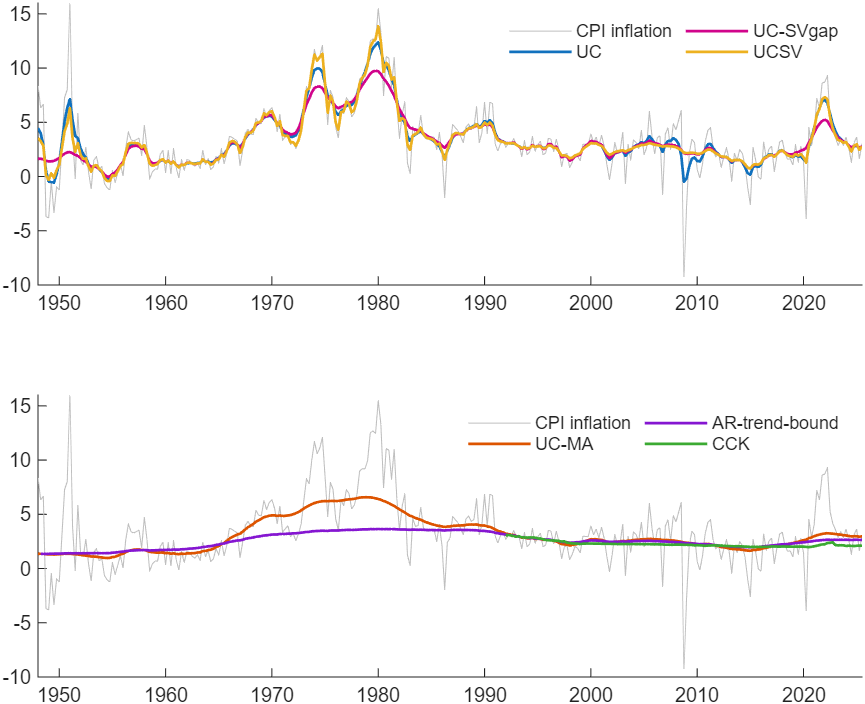
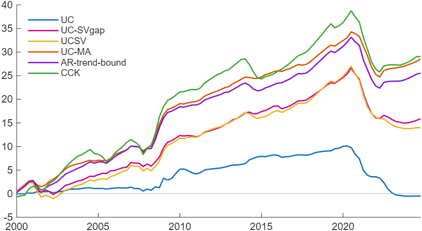

# Which Unobserved Components Model Should I Use for Inflation?

*Code: [`build.m`](build.m) and [`your_data.m`](your_data.m), with the samplers in
[`core/+ssm`](../../core/+ssm/). Method:
[Chan and Jeliazkov (2009)](../../CITING.md#chan-and-jeliazkov-2009),
[Kim, Shephard and Chib (1998)](../../CITING.md#kim-shephard-and-chib-1998),
[Chan (2013)](../../CITING.md#chan-2013),
[Chan, Koop and Potter (2013)](../../CITING.md#chan-koop-and-potter-2013) and
[Chan, Clark and Koop (2018)](../../CITING.md#chan-clark-and-koop-2018).*

In this tutorial we compare six unobserved components models of US CPI inflation by how well they
forecast average inflation over the next four quarters, with an AR(4) as the benchmark. Each model
splits inflation into a trend, the level at which inflation is expected to settle, and a
transitory gap. Because the gap fades, the forecast of average inflation over the next year is the
trend at the forecast origin plus the part of the current gap expected to persist, and averaging
over four quarters removes much of the quarter-to-quarter noise in CPI inflation. In three of the
six models this forecast is the trend at the origin, and in the other three the gap enters it
with a weight between 0.1 and 0.3 at the end of the sample, so the forecasts depend largely on
each model's estimate of the current trend, which itself is never observed.

The models use the same priors for the parameters they share, and each is re-estimated at each of
100 quarterly forecast origins from 1999Q4 to 2024Q3. Among them is UCSV, the unobserved
components model with stochastic volatility of Stock and Watson (2007), in which the variances of
both the trend and the gap change over time. We add UC-SVgap, which has stochastic volatility in
the gap alone, to separate the two volatilities.

Every model with stochastic volatility forecasts better than the AR(4), and UC, the one model
with constant variances, forecasts about as well as the AR(4). The model of Chan, Clark and Koop
(2018), which also uses the SPF's 10-year inflation expectation, has the lowest root mean squared
forecast error, 16 percent below the AR(4)'s. On the log predictive likelihood, it and UC-MA of
Chan (2013) lead the AR(4) by 29.1 and 28.5.

Under these specifications and priors, stochastic volatility helps in the gap and not in the
trend. Adding it to the gap of UC raises the log predictive likelihood by 16.3 and lowers the root
mean squared forecast error from 1.95 to 1.82. Adding it to the trend as well, which gives UCSV,
lowers the log predictive likelihood by 1.9 and leaves the root mean squared forecast error at
1.83. In these 100 forecasts, the root mean squared forecast error ranks the models with
stochastic volatility in the same order as the average change in their forecasts from one quarter
to the next.

## Try It Now

Two commands, from the root of the repository:

| Command | What it produces | Time |
|---|---|---|
| `run tutorials/uc_specification/your_data.m` | the comparison on the same data over the last six origins, with short chains, each model's forecast of the next four quarters, and the exported report | about a minute |
| `run tutorials/uc_specification/build.m` | every number and figure on this page | 151 minutes |

The short run checks that the workflow runs end to end; its six forecasts are far too few for the
numbers on this page, which all come from the full build. Its settings block is where you point it
at your own file.



*Figure 1: The posterior mean of trend inflation under each model, estimated on the whole sample,
with quarterly CPI inflation in gray. Top: UC, UC-SVgap and UCSV, whose trends follow inflation
closely. Bottom: UC-MA, AR-trend-bound and CCK, whose trends are smooth; the CCK trend starts in
1992Q1, when the SPF series begins.*

## The Seven Models

Inflation $`y_t`$ is annualized quarterly CPI inflation. The benchmark is an AR(4),

$$y_t = \beta_1 + \beta_2 y_{t-1} + \cdots + \beta_5 y_{t-4} + \epsilon_t, \qquad \epsilon_t \sim N(0, \sigma^2),$$

with the independent normal and inverse-gamma prior
$`\boldsymbol{\beta} \sim N(\mathbf{0}, 100\mathbf{I})`$ and $`\sigma^2 \sim IG(4, 1)`$, where
$`IG(\nu, S)`$ has density proportional to $`x^{-(\nu+1)}\mathrm{e}^{-S/x}`$.

Four of the trend models share one form. Inflation is a trend plus a gap,

$$y_t = \tau_t + u_t + \psi u_{t-1}, \qquad u_t \sim N(0, \mathrm{e}^{h_t}), \qquad u_0 = 0,$$

$$\tau_t = \tau_{t-1} + \varepsilon_t, \qquad \varepsilon_t \sim N(0, \mathrm{e}^{g_t}),$$

where $`\psi = 0`$ outside UC-MA, and each log variance, $`h_t`$ for the gap and $`g_t`$ for the
trend, is constant, a random walk or a stationary AR(1) process:

| Model | Gap | Trend innovation | Model from |
|---|---|---|---|
| UC | constant variance | constant variance | Chan (forthcoming), Section 9.1.1, with $`\rho = 0`$ |
| UC-SVgap | random-walk log-volatility | constant variance | UC, with the gap of UCSV |
| UCSV | random-walk log-volatility | random-walk log-volatility | Stock and Watson (2007) |
| UC-MA | MA(1), AR(1) log-volatility | constant variance | Chan (2013) |

In UC-MA the log-volatility of the gap is an AR(1) process started from its stationary
distribution. UC-SVgap is UCSV with the stochastic volatility of the trend switched off, the
restriction that Chan (2018) tests.

AR-trend-bound (Chan, Koop and Potter, 2013) has an autoregressive gap with a time-varying
coefficient,

$$y_t - \tau_t = \rho_t (y_{t-1} - \tau_{t-1}) + \mathrm{e}^{h_t/2}\epsilon_t, \qquad \epsilon_t \sim N(0, 1),$$

where $`\tau_t`$ and $`\rho_t`$ are random walks whose innovations are truncated so that
$`0 < \tau_t < 5`$ and $`0 < \rho_t < 1`$, and $`h_t`$ is a random walk. It runs through the
archived code of the paper, which fixes the bounds at 0 and 5 and takes the first quarter as the
gap before the sample.

CCK is M1 of Chan, Clark and Koop (2018). Its gap is autoregressive as in AR-trend-bound, with the
coefficient $`b_t`$ a random walk on $`(0, 1)`$; the trend $`\pi^*_t`$ is a random walk; both
equations have random-walk log-volatilities; and the long-run expectation $`z_t`$ loads on the
trend with a time-varying intercept and slope,

$$z_t = d_{0t} + d_{1t}\pi^*_t + w_t + \psi w_{t-1}, \qquad w_t \sim N(0, \sigma_w^2),$$

where $`(d_{0t}, d_{1t})`$ follow stationary AR(1) processes with means near 0 and 1. For $`z_t`$
we use the median 10-year CPI inflation forecast of the Survey of Professional Forecasters, which
starts in 1991Q4, so CCK is estimated from 1992Q1 with 1991Q4 as its presample. Its sampler is
written for this toolkit from the library functions: $`\psi`$ is drawn by an independence
Metropolis-Hastings step at the mode of its conditional density, found by Newton steps, and
$`b_t`$ in blocks of five.

The six unobserved components models use the same priors for the parameters they share, those of
Chan (2013) and Chan, Koop and Potter (2013). A constant variance of the trend innovations, in UC,
UC-SVgap, UC-MA and AR-trend-bound, is $`IG(10, 0.18)`$, with mean 0.02. Every log-volatility has
innovation variance $`IG(10, 0.45)`$, with mean 0.05, and a random-walk log-volatility starts from
a level with prior $`N(0, 5)`$. The trend starts from $`\tau_1 \sim N(0, 5)`$, and
$`\pi^*_1 \sim N(0, 5)`$ in CCK; in UCSV, $`\tau_1 \sim N(\tau_0, \mathrm{e}^{g_1})`$ with
$`\tau_0 \sim N(0, 5)`$. The autoregressive coefficient of the gap, $`\rho_t`$ in AR-trend-bound
and $`b_t`$ in CCK, starts from $`N(0, 1)`$ on $`(0, 1)`$, and the variance of its innovations is
$`IG(10, 0.009)`$. The remaining priors belong to one model each. The constant variance of the gap
in UC is $`IG(3, 2)`$. In UC-MA, the mean of the gap's log-volatility is $`N(0, 5)`$, its AR
coefficient is $`N(0.9, 1)`$ on $`(-1, 1)`$, and $`\psi \sim N(0, 1)`$ on $`(-1, 1)`$. The priors
of CCK's expectation equation are those of the paper's forecasting code.

## Results for US CPI Inflation

The data are [`examples/data/USCPI_quarterly.csv`](../../examples/data/USCPI_quarterly.csv), 400
times the log change in the quarterly average of the consumer price index from FRED, 1948Q1 to
2025Q3, and [`examples/data/USCPI10_SPF.csv`](../../examples/data/USCPI10_SPF.csv) for CCK. At
each origin from 1999Q4 to 2024Q3 every model is estimated on the data up to that quarter and
forecasts the average of the next four quarters, so the 100 targets run from 2000Q1-2000Q4 to
2024Q4-2025Q3. The data are today's revised series, so the forecasts are pseudo real time.

*Table 1: Forecasts of the average inflation over the next four quarters, 100 origins. The
difference in log predictive score is the model's sum of log predictive likelihoods minus that of
the AR(4); the four-quarter targets overlap, so the sum scores the forecasts one at a time and is
not a joint predictive likelihood. The last column is the average absolute change in the point
forecast from one origin to the next.*

| Model | RMSFE | RMSFE relative to AR(4) | Log predictive likelihood | Difference in log predictive score against AR(4) | Change in the forecast |
|---|---|---|---|---|---|
| AR(4) | 1.95 | 1.00 | -208.8 | 0.0 | 0.96 |
| UC | 1.95 | 1.00 | -209.2 | -0.5 | 0.69 |
| UC-SVgap | 1.82 | 0.93 | -192.9 | 15.9 | 0.44 |
| UCSV | 1.83 | 0.94 | -194.8 | 14.0 | 0.46 |
| UC-MA | 1.72 | 0.88 | -180.2 | 28.5 | 0.41 |
| AR-trend-bound | 1.70 | 0.87 | -183.2 | 25.5 | 0.38 |
| CCK | 1.64 | 0.84 | -179.7 | 29.1 | 0.20 |

The root mean squared forecast error (RMSFE) scores the point forecast, the mean of the predictive
distribution. The log predictive likelihood scores the whole distribution: it is the log of the
predictive density at the outcome, summed over the 100 forecasts. Both follow the forecasting code
of Chan, Koop and Potter (2016) and Chan, Clark and Koop (2018). CCK also uses the SPF's long-run
expectation and is estimated from 1992Q1, where the other models use the inflation series from
1948Q1, so the table compares complete forecasting specifications and does not isolate what the
survey contributes.

The 90% predictive intervals of the AR(4) contain 90 of the 100 outcomes and are 6.3 wide on
average. Those of the models with stochastic volatility are narrower, 4.3 to 5.1 on average, and
contain 81 to 87 of the outcomes; CCK's are the narrowest and contain the fewest.

### Does Stochastic Volatility Help?

UC, UC-SVgap and UCSV add stochastic volatility one equation at a time, so Table 1 answers the
question for each equation. Stochastic volatility in the gap raises the log predictive likelihood
of UC by 16.3 and lowers its RMSFE from 1.95 to 1.82; stochastic volatility in the trend as well
lowers the log predictive likelihood by 1.9 and raises the RMSFE to 1.83. UC itself ties the AR(4)
on the RMSFE and is 0.5 below it on the log predictive likelihood.

The last column of Table 1 measures how much each forecast moves from one origin to the next. In
UC, UC-SVgap and UCSV the forecast of average inflation over the next year is the current trend,
so for them the column measures how much the estimated trend moves. With constant variances, UC
attributes a fixed share of every surprise to the trend, so its trend follows the large quarterly
swings in CPI inflation, such as the fall in 2008Q4 (Figure 1), and its forecast changes by 0.69
on average, against 0.96 for the AR(4). Stochastic volatility in the gap lets the model attribute
the surprises of a volatile period to the gap, and the average change falls to 0.44. With
stochastic volatility in the trend as well, the average change is 0.46, and UCSV forecasts
slightly worse than UC-SVgap on both criteria.

### Which Unobserved Components Model Forecasts Best?

UC-MA, AR-trend-bound and CCK forecast best. Their forecasts also change the least from one
quarter to the next. CCK ties its trend to the SPF's long-run expectation and has the smoothest
forecasts and the lowest RMSFE; its log predictive likelihood and UC-MA's differ by 0.5. UC-MA has
the same prior for its constant trend variance as UC and UC-SVgap, and its gap adds a moving
average term and a stationary log-volatility; its MA coefficient is positive, with posterior mean
0.445 and 90% interval (0.337, 0.547). AR-trend-bound bounds its trend between 0 and 5 percent.



*Figure 2: The cumulative difference in log predictive score of each model against the AR(4),
plotted at the first quarter of each forecast window. Every model gains on the AR(4) from 2000
to 2020 and loses part of the gain on the forecasts that cover 2021 and 2022; UC loses all of it.*

## How the Forecasts Are Computed

At each origin each model is estimated by Markov chain Monte Carlo on the data up to that quarter:
20,000 draws after a burn-in of 5,000, and 10,000 after 1,000 for CCK. UC, UC-SVgap, UCSV, UC-MA
and CCK are drawn by Gibbs samplers built with
[`ssm.simulate_states`](../../core/+ssm/simulate_states.m) for the trend and the auxiliary mixture
sampler of Kim, Shephard and Chib (1998) for the log-volatilities
([`ssm.ksc_rw_h0`](../../core/+ssm/ksc_rw_h0.m),
[`ssm.ksc_ar1_mean`](../../core/+ssm/ksc_ar1_mean.m) and
[`ssm.ksc_rw_diffuse`](../../core/+ssm/ksc_rw_diffuse.m)). AR-trend-bound runs the
[archived sampler](../../replications/chan_koop_potter2013_jbes_trendbound/) of Chan, Koop and
Potter (2013), which draws $`\tau_t`$, $`\rho_t`$ and $`h_t`$ by
accept-reject Metropolis-Hastings steps.

At each posterior draw the log-volatilities, and in AR-trend-bound and CCK the coefficient of the
autoregressive gap, are simulated four quarters ahead; in AR-trend-bound the bounded trend is
simulated as well. Given those paths the average of the next four quarters is normal, with the
remaining innovations integrated out. Where the trend is an unbounded random walk, the mean is
the trend at the origin plus the part of the current gap expected to persist. The next four trend
innovations enter the average with weights 1, 3/4, 1/2 and 1/4, so the variance adds their
variances with weights 1, 9/16, 1/4 and 1/16, and those of the gap innovations with weights that
depend on $`\psi`$ or on the autoregressive coefficients. In AR-trend-bound, whose truncated trend
innovations are not normal, the mean is the average of the simulated trend over the four quarters
plus the part of the current gap expected to persist, and the variance comes from the gap
innovations alone. The predictive density is the average of these normal densities over the
draws, and the point forecast is the average of their means. The AR(4) needs no simulation: given
each draw, its forecast is normal, with the variance from its moving average weights.

## Checking the Estimates

The build checks the predictive densities before it uses them. For UC at fixed variances, the log
predictive density of the last quarter, averaged over draws of the trend from
[`ssm.simulate_states`](../../core/+ssm/simulate_states.m), is -1.2566 (0.0009), against the
exact -1.2562 from [`ssm.intlike`](../../core/+ssm/intlike.m). For every model, the predictive
distributions computed from the formulas above match paths of inflation simulated forward from
the same posterior draws: their distribution functions differ by at most 0.003 at the 5th to 95th
percentiles.

The inefficiency factors of the parameters, from the whole-sample chains with a Bartlett window
of 100 lags, run from 1.9 to 82; the highest belong to UCSV. The Metropolis-Hastings steps accept
often: 97 percent for $`\psi`$ in UC-MA and 98 percent in CCK, 76 percent for the AR coefficient
of the log-volatility in UC-MA, 94 percent for the blocks of $`b_t`$ in CCK, and 81, 62 and 80
percent for the trend, $`\rho_t`$ and $`h_t`$ in the archived sampler of AR-trend-bound.

## Applying the Method to Your Data

The script [`your_data.m`](your_data.m) runs the same comparison on a quarterly inflation series.
Its settings block sets the file, the column, the date column, the file and column of a long-run
expectation for CCK (or none, which leaves CCK out), the models to compare, the number of origins,
the draws per model, the seed, whether each model also forecasts the four quarters after the last
one, and where the report goes. The series should be an inflation rate in annualized percent, the
scale the priors are set for, with one value per quarter. AR-trend-bound keeps the bounds of the
US application, 0 and 5 percent, which its archived code fixes, so for a series whose trend may
leave that band, delete its row from `models` in the script. The script drops rows missing at
either end of the sample, and stops on a missing value inside it, on dates that are not one
quarter apart, on a constant series, and on a new series while the expectation file is still the
US one.

Each forecast comes from one call,

```matlab
r = fc_origin(repo, y, z, t, 'UC-SVgap', struct('nsim', 20000, 'burnin', 5000), seed);
```

which estimates the model on `y(1:t)` and returns the point forecasts and log predictive
likelihoods of the next quarter and of the average over the next four, and the 90% predictive
interval of that average; with `t = numel(y)` it forecasts from the last quarter, and the scores
are `NaN`. It and the samplers are in [`private/`](private/), so scripts in this folder can call
them; `uc_model` holds the specifications and priors of the unobserved components models, and a
new specification is a new entry in it.

The script writes what it computed to `outdir`, which defaults to `tempdir` so that a run leaves
the repository unchanged. `uc_specification_report.csv` holds one row per model, with its scores
and its forecast from the last quarter with the 90% interval, and `uc_specification_report.mat`
holds that table with the settings behind it. Setting `outdir = ''` turns the export off.

## Reproducing the Results

To reproduce all results on this page, run the build script from the root of the repository:

```matlab
run tutorials/uc_specification/build.m
```

The script `build.m` reads the data, checks the predictive densities, runs one chain per model on
the whole sample and the recursive forecasts, and saves them in `runs/`, which is not part of the
repository, so that an interrupted build resumes where it stopped. The computation takes
151 minutes using MATLAB R2025b on a computer with an Intel Core Ultra 7 255U processor
and 32 GB of RAM. The script prints every result in this tutorial, or the numbers they are
computed from, and saves the figures in the same folder as this page, together with
[`forecasts.csv`](forecasts.csv), which holds every forecast behind Table 1: one row per model
and origin, with the target quarters, the realized average, the point forecast, the 90%
predictive interval and the log predictive density.

## References

Chan, J. C. C. (2013). Moving Average Stochastic Volatility Models with Application to Inflation
Forecast. *Journal of Econometrics*, 176(2): 162-172.
[doi:10.1016/j.jeconom.2013.05.003](https://doi.org/10.1016/j.jeconom.2013.05.003)

Chan, J. C. C. (2018). Specification Tests for Time-Varying Parameter Models with Stochastic
Volatility. *Econometric Reviews*, 37(8): 807-823.
[doi:10.1080/07474938.2016.1167948](https://doi.org/10.1080/07474938.2016.1167948)

Chan, J. C. C. (forthcoming). *Bayesian Macroeconometrics: Methods and Applications*. Chapman &
Hall/CRC. [Code repository](https://github.com/joshuaccchan/bayesian-macroeconometrics)

Chan, J. C. C., Clark, T. E. and Koop, G. (2018). A New Model of Inflation, Trend Inflation, and
Long-Run Inflation Expectations. *Journal of Money, Credit and Banking*, 50(1): 5-53.
[doi:10.1111/jmcb.12452](https://doi.org/10.1111/jmcb.12452)

Chan, J. C. C. and Jeliazkov, I. (2009). Efficient Simulation and Integrated Likelihood
Estimation in State Space Models. *International Journal of Mathematical Modelling and Numerical
Optimisation*, 1(1/2): 101-120. [doi:10.1504/IJMMNO.2009.030090](https://doi.org/10.1504/IJMMNO.2009.030090)

Chan, J. C. C., Koop, G. and Potter, S. M. (2013). A New Model of Trend Inflation. *Journal of
Business and Economic Statistics*, 31(1): 94-106.
[doi:10.1080/07350015.2012.741549](https://doi.org/10.1080/07350015.2012.741549)

Chan, J. C. C., Koop, G. and Potter, S. M. (2016). A Bounded Model of Time Variation in Trend
Inflation, NAIRU and the Phillips Curve. *Journal of Applied Econometrics*, 31(3): 551-565.
[doi:10.1002/jae.2442](https://doi.org/10.1002/jae.2442)

Kim, S., Shephard, N. and Chib, S. (1998). Stochastic Volatility: Likelihood Inference and
Comparison with ARCH Models. *Review of Economic Studies*, 65(3): 361-393.
[doi:10.1111/1467-937X.00050](https://doi.org/10.1111/1467-937X.00050)

Stock, J. H. and Watson, M. W. (2007). Why Has U.S. Inflation Become Harder to Forecast?
*Journal of Money, Credit and Banking*, 39(s1): 3-33.
[doi:10.1111/j.1538-4616.2007.00014.x](https://doi.org/10.1111/j.1538-4616.2007.00014.x)

[`CITING.md`](../../CITING.md) lists the paper to cite for each model and method. To cite the
toolkit itself: Chan, J. C. C. (2026). *statespace-toolkit: MATLAB code for Bayesian state space
models*. Zenodo. [doi:10.5281/zenodo.22884655](https://doi.org/10.5281/zenodo.22884655)

The BibTeX entries are:

```bibtex
@article{chan2013,
  author  = {Chan, Joshua C. C.},
  title   = {Moving Average Stochastic Volatility Models with Application to Inflation Forecast},
  journal = {Journal of Econometrics},
  volume  = {176},
  number  = {2},
  pages   = {162--172},
  year    = {2013},
  doi     = {10.1016/j.jeconom.2013.05.003}
}
@article{chan_clark_koop2018,
  author  = {Chan, Joshua C. C. and Clark, Todd E. and Koop, Gary},
  title   = {A New Model of Inflation, Trend Inflation, and Long-Run Inflation Expectations},
  journal = {Journal of Money, Credit and Banking},
  volume  = {50},
  number  = {1},
  pages   = {5--53},
  year    = {2018},
  doi     = {10.1111/jmcb.12452}
}
@article{chan_jeliazkov2009,
  author  = {Chan, Joshua C. C. and Jeliazkov, Ivan},
  title   = {Efficient Simulation and Integrated Likelihood Estimation in State Space Models},
  journal = {International Journal of Mathematical Modelling and Numerical Optimisation},
  volume  = {1},
  number  = {1/2},
  pages   = {101--120},
  year    = {2009},
  doi     = {10.1504/IJMMNO.2009.030090}
}
@article{chan_koop_potter2013,
  author  = {Chan, Joshua C. C. and Koop, Gary and Potter, Simon M.},
  title   = {A New Model of Trend Inflation},
  journal = {Journal of Business and Economic Statistics},
  volume  = {31},
  number  = {1},
  pages   = {94--106},
  year    = {2013},
  doi     = {10.1080/07350015.2012.741549}
}
@article{stock_watson2007,
  author  = {Stock, James H. and Watson, Mark W.},
  title   = {Why Has {U.S.} Inflation Become Harder to Forecast?},
  journal = {Journal of Money, Credit and Banking},
  volume  = {39},
  number  = {s1},
  pages   = {3--33},
  year    = {2007},
  doi     = {10.1111/j.1538-4616.2007.00014.x}
}
@misc{statespace_toolkit,
  author       = {Chan, Joshua C. C.},
  title        = {statespace-toolkit: {MATLAB} Code for {B}ayesian State Space Models},
  year         = {2026},
  howpublished = {Zenodo},
  doi          = {10.5281/zenodo.22884655},
  url          = {https://github.com/joshuaccchan/statespace-toolkit}
}
```
